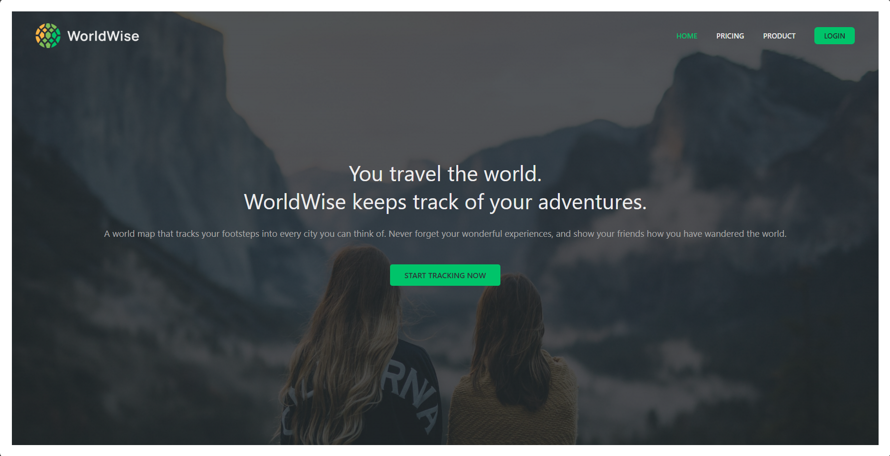
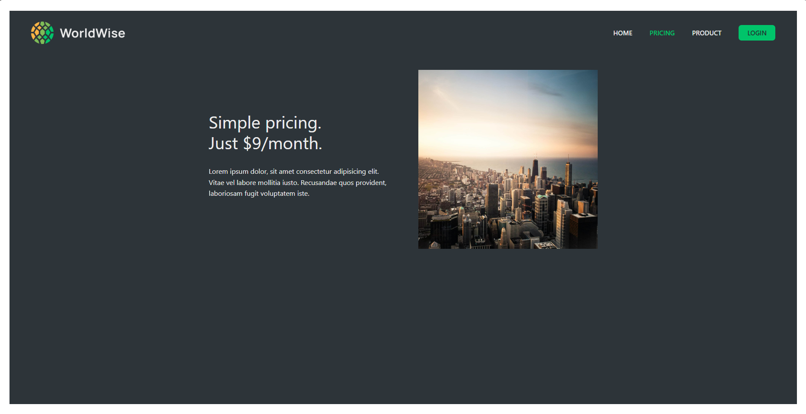
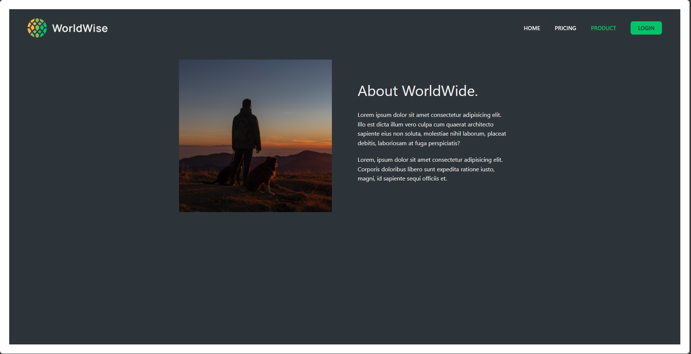
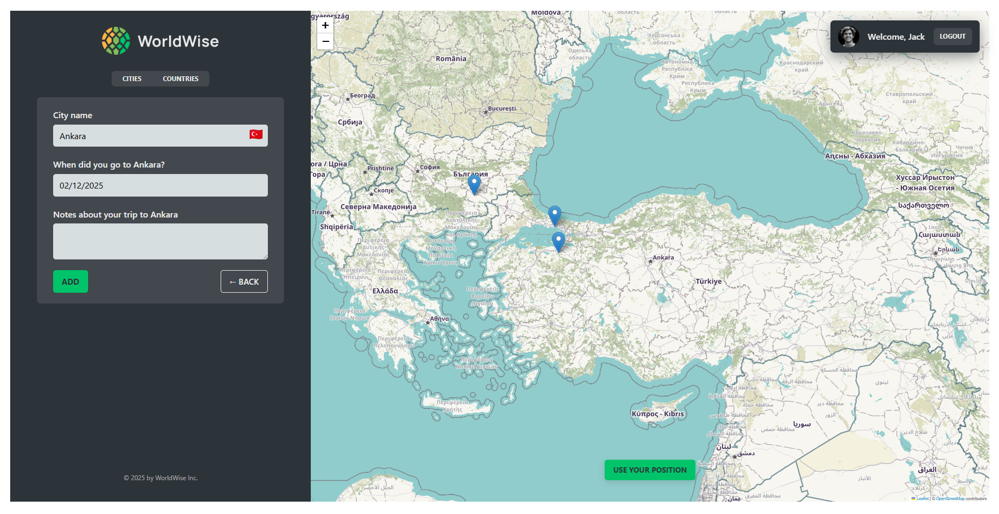
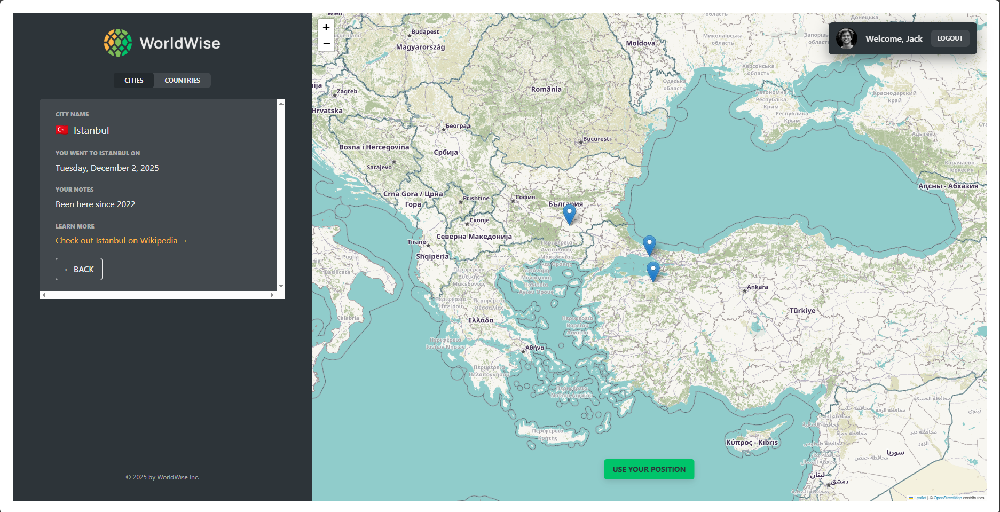

# WorldWide 🌍

**A location-tracking web application that lets users save, view, and manage their favorite travel locations worldwide.**

---

## Table of Contents

1. [About the Project](#about-the-project)
2. [Features](#features)
3. [Screenshots](#screenshots)

- [Prerequisites](#prerequisites)
- [Installation](#installation)

4. [Usage](#usage)
5. [License](#license)
6. [Contact](#contact)

---

## About the Project

WorldWide is a location-based web application that lets users save, view, and manage their favorite travel locations worldwide. Perfect for travel enthusiasts, this app allows you to add personal for each location, creating a visual travel diary.

## Features

- **Interactive Map Integration**: Mark any location with Google Maps.
- **Personalized Details**: Add notes, and dates for each location.
- **Place Management**: Add, and delete favorite places.
- **Account Management**: Delete your account securely.

---

## Screenshots

### Home Page

### Pricing Page

### Product Page

### Login Page

### Map View

### Add Place

### Detailed City Description

---

## Usage

1. **Log In**: You do not have to use personal infos.
2. **Explore the Map**: Click anywhere to add a new place.
3. **Add Details**: Add name, date, and notes, for each place.
4. **View Saved Places**: Access a list of saved places.

---

## License

Distributed under the MIT License. See `LICENSE` for more information.

---

## Contact

Emirhan Karagöz - [emirhan-karagoz1@hotmail.com](mailto:sancakliaykin@gmail.com)

Project Link: [GitHub Repository](https://github.com/Wallinera/WorldWide)

Live Site URL: [worldwide.vercell.app](https://world-wide-omega.vercel.app/app/cities)
